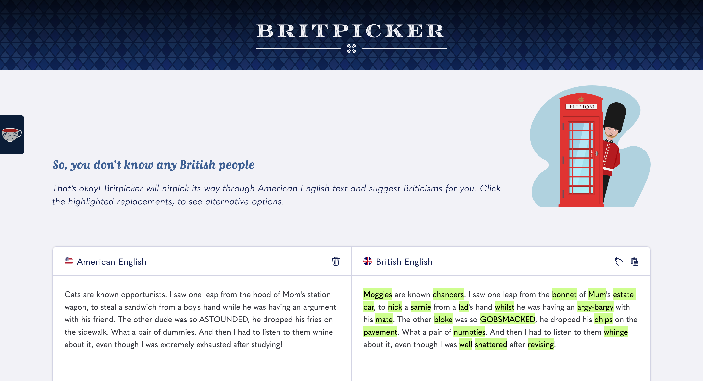
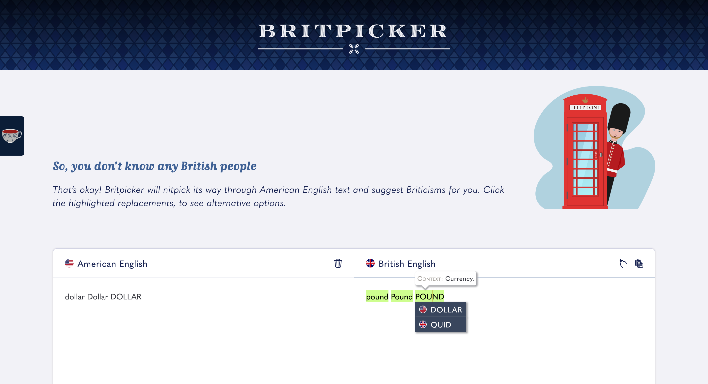
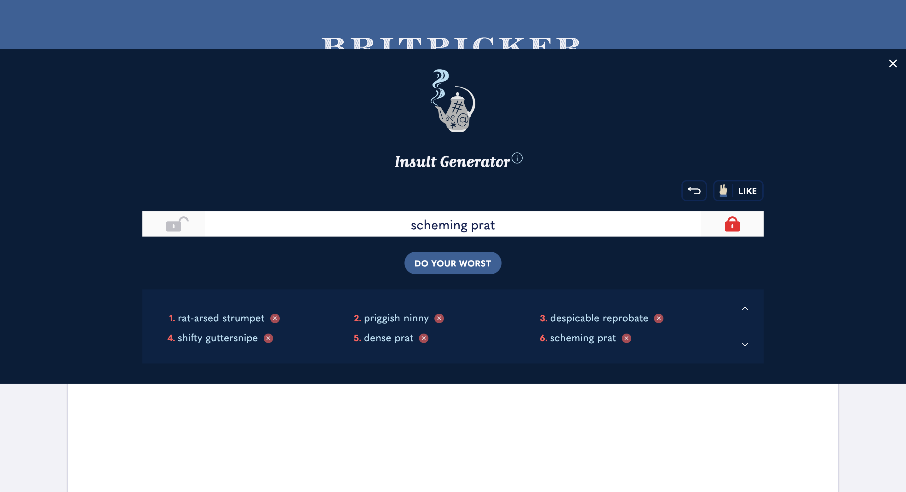
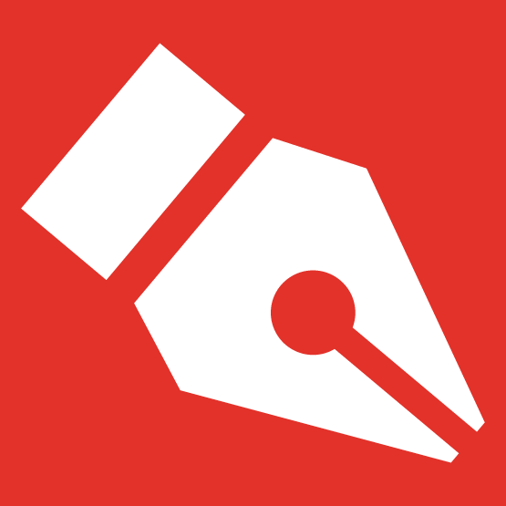

# Britpicker

## Table of Contents

 + [Introduction](#introduction)
 + [Features](#features)
    - [Final Edits](#final-edits)
    - [Insult Generator](#insult-generator)
 + [Favicon](#favicon)
 + [Tech Specs](#tech-specs)

## Introduction

 

 [Britpicker](https://cassiopeian.github.io/britpicker) parses through American English text and suggests Briticisms to writers who need help crafting dialogue for British characters.

## Features
 
 ## Final Edits

 

 When you’ve finished typing or pasting the input text, you have a few options for final edits. If a “translation” isn’t quite right, click the highlighted text to display dropdown options. Every word can be reverted back to the original American English, and certain words have additional British alternatives. These replacements, like the initial suggestions, will match the case of the American English text. 

 You can strip the highlights, so they aren’t copied to your clipboard, by clicking the highlighter icon. If you want to start over, click the trash can (*dustbin*) icon. 

 ### Insult Generator

 

 Feeling tripped up by esprit de l’escalier? The Insult Generator can create a seemingly endless number of slights, with the click of a button.

 + **Insult Me Button** &mdash; Pairs randomized adjectives and nouns, to create a new insult. The button’s confrontational text will also change, with each click.
 + **Like Button** &mdash; Builds a list of your favorite put-downs.
 + **Return Button** &mdash; Recalls the previous insult, in case you regret not adding it to your list.
 + **Lock Buttons** &mdash; Maintain adjectives or nouns that speak to you. In the example, above, *prat* was locked, so it’s repeated in the sixth insult.
 + **Delete Buttons** &mdash; Remove insults you change your mind about. These buttons trigger a confirmation pop-up.

## Favicon

 

 When I set out to design the Britpicker favicon, I considered the project’s core themes. Favicons are too small to meaningfully display flags for two nations, so I focused on the aspect of writing. My hope is that the red background behind the pen nib evokes an editor’s marks. The phone box illustration and Insult Generator locks are the same shade of red.

## Inspiration

 I’m fascinated by language and the precise way dialect can reveal and categorize us. Some words are so specific to a region, you can tell which side of a state a person hails from. In Pittsburgh, *yinz* refers to a group of people, whereas *jawns* would be used in Philadelphia.

 Sometimes our tells are so ingrained, we aren’t even aware we’re giving ourselves away. I’ve read books by British and Australian authors who painstakingly alter their language, yet supposedly American characters will say, “My house is **in** Hummingbird Drive.” So, Britpicker is for all the American writers who are doing their best&mdash;but have never heard the word *paracetamol*.

 (Mind you, as a copy editor, I loved projects where I was tasked with Americanizing the text. I always felt like I’d been given a little side quest!)

## Tech Specs

 Britpicker was built with jQuery version 3.4.1.
